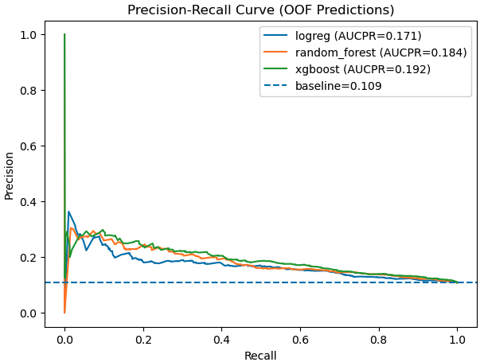
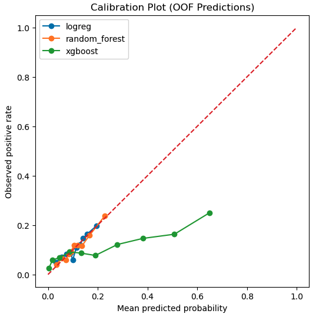

# spring-2026-radon-risk-mapping
Team project: spring-2026-radon-risk-mapping

### Team members
1. John Berezney
2. Manimugdha Saikia
3. Huiyao Kuang
4. Emmanuel Asante

### Project overview
This project aims to analyze and predict residential radon risk across Canada using a combination of geological, housing, socioeconomic, climatic, and uranium-related features aggregated at the Forward Sortation Area (FSA) level.  

By integrating radon survey data with census, geological, uranium concentration, and climatic datasets, we aim to better understand which FSAs are more likely to have high radon concentrations and to support risk-informed decision-making.

### Motivation and problem statement
Radon is a naturally occurring radioactive gas and one of the leading causes of lung cancer among non-smokers. Because radon risk is influenced by both geological and built-environment factors, it is important to identify areas with high risk and understand the main contributing features.

In this project, we ask the following question:
"Can we predict high radon risk for each FSA using available census, geological, uranium concentration, and climatic data?"

### Stakeholders
The primary stakeholders for this project include public health agencies, policymakers, and local communities in Canada, who may use this analysis to help prioritize radon testing, mitigation efforts, and risk communication. More broadly, this modeling framework may also be useful to researchers and public health organizations in other countries or regions facing similar radon exposure challenges, particularly where monitoring coverage is limited.

### Dataset
1. Our primary radon data were collected at the household level across Canada, with multiple household-level observations available within many FSAs. For each household, we defined a binary indicator of elevated radon risk, where radon concentration greater than 200 Bq/m$^3$ was assigned a value of 1 and 0 otherwise. We then aggregated these household-level indicators within each FSA to obtain an FSA-level fraction target representing the proportion of sampled homes with elevated radon risk.

2. Our predictive features include census-derived housing, demographic, and socioeconomic indicators, geological province and rock-type variables, surficial sedimentary types, uranium concentration, and heating degree day data. These datasets were spatially aligned, cleaned, and merged into a unified FSA-level modeling table, which was used to predict the FSA-level radon risk fraction.

### Modeling approach
We framed this project as a binary classification task to predict whether a Forward Sortation Area (FSA) exceeds a radon-risk threshold derived from household radon measurements. We compared three models: Logistic Regression as an interpretable baseline, Random Forest as a flexible ensemble method, and XGBoost as a higher-capacity gradient-boosted model. Because the project is inherently spatial, we used a held-out test set together with nested cross-validation for model selection and hyperparameter tuning, while designing the validation splits to reduce spatial leakage. Since our goal was to produce meaningful risk estimates for public-health interpretation, we treated predicted probability as the main output. As a result, calibration was prioritized over ranking alone, although ranking performance remained an important secondary consideration.

### Evaluation metrics
Because our goal was to estimate meaningful radon risk probabilities rather than only rank high-risk FSAs, we evaluated models using both calibration and ranking metrics.

For calibration, we used log loss, Brier score, and ECE.
For ranking, we used AUC-PR and ROC-AUC.

Since the target is imbalanced, AUC-PR was especially important for ranking performance, while calibration metrics were prioritized because predicted probability was treated as the main output.

### Results
1. Cross-validation model comparison showed that all three models captured some predictive signal, but their strengths differed. XGBoost achieved the strongest ranking performance, while Random Forest provided better-calibrated probabilities. Because our primary goal was meaningful risk estimation rather than ranking alone, Random Forest was selected as the final model.

2. On the held-out test set, the final Random Forest achieved ROC-AUC = 0.649, AUC-PR = 0.184, log loss = 0.329, Brier score = 0.094, and ECE = 0.001. Compared with the out-of-fold results, ranking performance remained similar or slightly improved, while calibration degraded modestly. Overall, this suggests that the model generalizes reasonably well, although the task remains challenging.

3. Model interpretation based on permutation importance indicated that the most influential predictors included geologic province, uranium-related variables, longitude, rock type indicators, and several housing and socioeconomic features. This pattern suggests that the model captures both geologic structure and broader regional context.

### Conclusions
This project shows that radon risk is predictable to some extent at the FSA level using publicly available contextual data. The final model captures a meaningful combination of geologic, climatic, housing, and socioeconomic structure, but the problem remains difficult and the resulting probabilities should be interpreted as screening-oriented risk estimates rather than precise predictions. In this sense, the project is best viewed as a decision-support framework for identifying areas that may warrant greater public-health attention, rather than a substitute for direct household radon testing.

### Future plans
- Test explicitly spatial and hierarchical models that better reflect the geographic structure of radon risk

- Explore post-training calibration methods, especially for higher-capacity models such as XGBoost

- Incorporate additional predictors related to housing characteristics, radon knowledge, and mitigation infrastructure

- Improve the target construction and feature space as newer census or environmental data become available

- Investigate whether finer-resolution spatial data can improve discrimination and calibration

### Repo structure
