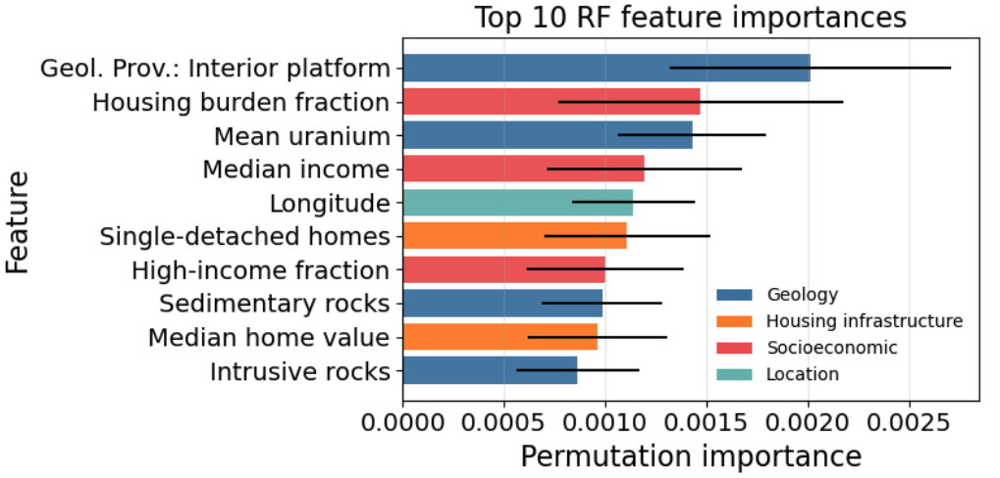

# spring-2026-radon-risk-mapping
Team project: spring-2026-radon-risk-mapping

### Team members
1. John Berezney
2. Manimugdha Saikia
3. Huiyao Kuang
4. Emmanuel Asante

### Project overview
This project predicts residential radon risk across Canada using geological, housing infrastructural, socioeconomic, and demographic features aggregated at the Forward Sortation Area (FSA) level with the broader goal of providing calibrated risk metrics for public-health decision-making.

### Motivation and problem statement
Radon is a naturally occurring radioactive gas and one of the leading causes of lung cancer among non-smokers. Because radon risk is influenced by both geological and built-environment factors, it is important to identify areas with high risk and understand the main contributing features.

In this project, we ask the following question:
"Can we predict whether an FSA exceeds a radon-risk threshold?"

### Stakeholders
The primary stakeholders for this project include public health agencies, policymakers, and local communities in Canada, who may use this analysis to help prioritize radon testing, mitigation efforts, and risk communication. More broadly, this modeling framework may also be useful to researchers and public health organizations in other countries or regions facing similar radon exposure challenges, particularly where monitoring coverage is limited.

### Dataset
1. Our primary radon data came from the Cross-Canada Survey of Radon Concentrations in Homes, a survey of long-term measurements of radon concentrations in volunteer homes from 2009 – 2011. In this study, data was collected at the household level across Canada. However, for privacy purposes, the Canadian government represents the location of each measurement at the Forward Sortation Area (FSA) scale, with multiple household-level observations available within many FSAs. For each household, we defined a binary indicator of elevated radon risk, based on the threshold for 'action' recommended by Health Canada:  radon concentration greater than 200 Bq/m3 was assigned a value of 1 and 0 otherwise. 

4. Our predictive features include census-derived housing, demographic, and socioeconomic indicators, geological province and rock-type variables, surficial sedimentary types, uranium concentration, and heating degree day data. These datasets were spatially aligned, cleaned, and merged into a unified FSA-level modeling table, which was used to predict whether an FSA exceeded the radon-risk threshold.

### Modeling approach
We framed this project as a binary classification task to predict whether an FSA exceeds a radon-risk threshold derived from household radon measurements aggregated at the FSA level. We compared three models: Logistic Regression as an interpretable baseline, Random Forest as a flexible ensemble method, and XGBoost as a higher-capacity gradient-boosted model. Because the project is inherently spatial, we used a held-out test set together with nested cross-validation for model selection and hyperparameter tuning, while designing the validation splits to reduce spatial leakage. Since our goal was to produce meaningful risk estimates for public-health interpretation, we treated predicted probability as the main output. As a result, calibration was prioritized over ranking alone, although ranking performance remained an important secondary consideration.

### Evaluation metrics
Because our goal was to estimate meaningful radon-risk probabilities rather than only rank high-risk FSAs, we evaluated models using both calibration and ranking metrics.

Primary calibration metrics included log loss, Brier score, and Expected Calibration Error (ECE), while secondary ranking metrics included AUC-PR and ROC-AUC.

Because the target is imbalanced, AUC-PR was especially important for ranking performance, while calibration metrics were prioritized because predicted probability was treated as the main output.

### Results
1. Cross-validation model comparison showed that all three models captured some predictive signal, but their strengths differed. Although XGBoost achieved stronger ranking performance, Random Forest provided the best overall balance between calibration and ranking and was therefore selected as the final model.

2. On the held-out test set, the final Random Forest model held up well relative to the cross-validated results. Ranking performance was preserved or slightly improved, while calibration was modestly weaker than the out-of-fold estimate. Overall, this suggests that the model generalizes reasonably well to unseen data and produces meaningful health-risk probabilities, even though the prediction task remains challenging.

3. Model interpretation using permutation importance showed that the most influential predictors were drawn from a mix of feature categories, including geologic structure, geographic context, and housing- and socioeconomic-related variables. This pattern suggests that the model captures both underlying geology and broader regional living conditions.

### Conclusions

This project shows that radon risk can be estimated to a useful extent at the FSA level using publicly available contextual data. The final Random Forest model generates meaningful health-risk probabilities, although the prediction task remains challenging and the resulting estimates should be interpreted as screening-oriented rather than precise predictions. In this sense, the project is best viewed as a decision-support framework for identifying areas that may warrant greater public-health attention, rather than a substitute for direct household radon testing.

### Future plans
- Test explicitly spatial and hierarchical models that better reflect the geographic structure of radon risk

- Explore post-training calibration methods, especially for higher-capacity models such as XGBoost

- Incorporate additional predictors related to housing characteristics, radon knowledge, and mitigation infrastructure

- Improve the target construction and feature space as newer census or environmental data become available

### Repo structure
