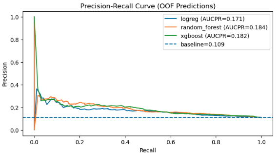
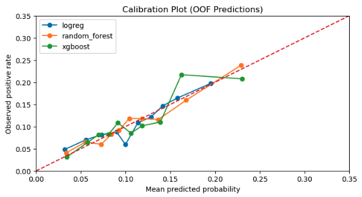

# spring-2026-radon-risk-mapping
Team project: spring-2026-radon-risk-mapping

### Team members
1. John Berezney
2. Manimugdha Saikia
3. Huiyao Kuang
4. Emmanuel Asante

### Project overview
This project predicts residential radon risk across Canada using geological, housing infrastructural, socioeconomic, and demographic features aggregated at the Forward Sortation Area (FSA) level with the broader goal of providing calibrated risk metrics for public-health decision-making.

### Motivation and problem statement
Radon is a naturally occurring radioactive gas and one of the leading causes of lung cancer among non-smokers. Because radon risk is influenced by both geological and built-environment factors, it is important to identify areas with high risk and understand the main contributing features.

In this project, we ask the following question:
"Can we predict whether an FSA exceeds a radon-risk threshold?"

### Stakeholders
The primary stakeholders for this project include public health agencies, policymakers, and local communities in Canada, who may use this analysis to help prioritize radon testing, mitigation efforts, and risk communication. More broadly, this modeling framework may also be useful to researchers and public health organizations in other countries or regions facing similar radon exposure challenges, particularly where monitoring coverage is limited.

### Dataset
1. Our primary radon data came from the Cross-Canada Survey of Radon Concentrations in Homes, a survey of long-term measurements of radon concentrations in volunteer homes from 2009 – 2011. In this study, data was collected at the household level across Canada. However, for privacy purposes, the Canadian government represents the location of each measurement at the Forward Sortation Area (FSA) scale, with multiple household-level observations available within many FSAs. For each household, we defined a binary indicator of elevated radon risk, based on the threshold for 'action' recommended by Health Canada:  radon concentration greater than 200 Bq/m$^3$ was assigned a value of 1 and 0 otherwise. 

4. Our predictive features include census-derived housing, demographic, and socioeconomic indicators, geological province and rock-type variables, surficial sedimentary types, uranium concentration, and heating degree day data. These datasets were spatially aligned, cleaned, and merged into a unified FSA-level modeling table, which was used to predict whether an FSA exceeded the radon-risk threshold.

### Modeling approach
We framed this project as a binary classification task to predict whether a Forward Sortation Area (FSA) exceeds a radon-risk threshold derived from aggregated household radon labels. We compared three models: Logistic Regression as an interpretable baseline, Random Forest as a flexible ensemble method, and XGBoost as a higher-capacity gradient-boosted model. Because the project is inherently spatial, we used a held-out test set together with nested cross-validation for model selection and hyperparameter tuning, while designing the validation splits to reduce spatial leakage. Since our goal was to produce meaningful risk estimates for public-health interpretation, we treated predicted probability as the main output. As a result, calibration was prioritized over ranking alone, although ranking performance remained an important secondary consideration.

### Evaluation metrics
Because our goal was to estimate meaningful radon risk probabilities rather than only rank high-risk FSAs, we evaluated models using both calibration and ranking metrics.

For calibration, we used direct observation of the calibration plots, Brier score, and ECE.
For ranking, we used PR plots and AUC-PR due to the imbalance of the target in the dataset.

### Results
1. Cross-validation model comparison showed that all three models captured some predictive signal, with no model far-exceeding the others across all metrics. XGBoost and Random Forest achieved marginally stronger ranking performance compared to the Logicstic Regression model. When examining calibration, the Random Forest provided slightly better-calibrated probabilities than the other two models. Random Forest was selected as the final model  because it was reasonably balanced between ranking and calibration and because it barely outscored the other models (in particular with respect to calibration).

2. The final hyperparameter-tuned Random Forest model held up well on the test set. Compared with the out-of-fold validation results, ranking performance remained similar or slightly improved, while calibration degraded modestly. Overall, the performance is modest but, while the model generalizes reasonably well, the task remains challenging.

3. Model interpretation based on permutation importance indicated that the most influential predictors included geologic province, uranium-related variables, longitude, rock type indicators, and several housing and socioeconomic features. This pattern suggests that the model captures both geologic structure and broader regional context.

### Conclusions
This project shows that radon risk is predictable at the FSA level using publicly available data. The final model delivers a meaningful representation of radon risk at the FSA level using a sensible combination of geologic, climatic, housing, and socioeconomic structure. The project is best viewed as a decision-support framework for identifying areas that may warrant greater public-health attention, rather than a substitute for direct household radon testing.

### Future plans
- Test explicitly spatial and hierarchical models that better reflect the geographic structure of radon risk

- Explore post-training calibration methods, especially for higher-capacity models such as XGBoost

- Incorporate additional predictors related to housing characteristics, radon knowledge, and mitigation infrastructure

- Improve the target construction and feature space as newer census or environmental data become available

### Repo structure
